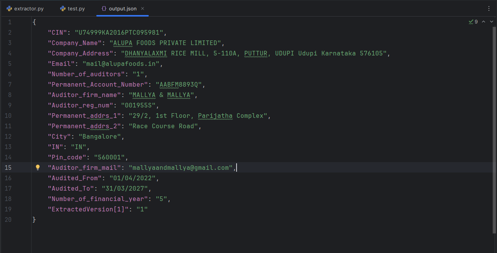

# 📄 Extract and Save PDF Form Data Using PyPDF2

This Python script reads form fields from a signed PDF (`Form ADT-1-29092023_signed.pdf`), extracts key-value pairs, maps field names to human-readable labels, and saves the cleaned data as a JSON file.

---

## 📦 Required Libraries and python version

```python
import json
import PyPDF2

```

---

## 📥 Step 1: Open and Read the PDF

```python
with open("Form ADT-1-29092023_signed.pdf", "rb") as file:
    reader = PyPDF2.PdfReader(file)
    extracted_texts = reader.get_form_text_fields()
```

- Opens the PDF file in binary mode.
- Reads interactive form fields using `PyPDF2`.

---

## 🧾 Step 2: Define Field Label Mapping

```python
formatted_key = {
    "CIN_C[0]" : "CIN",
    "CompanyName_C[0]" : "Company_Name",
    "CompanyAdd_C[0]" : "Company_Address",
    "EmailId_C[0]" : "Company_Email",
    "CurrDate[0]" : "Current_date",
    "PAN_C[0]" : "Account_number_of_auditors_firm",
    "NameAuditorFirm_C[0]" : "Firm_Name",
    "permaddress2a_C[0]" : "Permanent_Address_1",
    "permaddress2b_C[0]" : "Permanent_Address_1",
    "City_C[0]" : "City",
    "Country_C[0]" : "Country",
    "Pin_C[0]" : "Pin_code",
    "email[0]" : "Auditor_mail",
    "DateOfAccAuditedFrom_D[0]" : "Date_audit_form",
    "DateOfAccAuditedTo_D[0]" : "Date_audit_to",
    "NumOfFinanYearApp[0]" : "Number_of_final_year",
    "serialNumber[0]" : "Serial_Number",
    "Attachment_C[0]" : "Attachments",
}
```

- Maps raw PDF field names to meaningful labels for clarity in the output JSON.

---

## 🔄 Step 3: Process and Clean the Data

```python
new_dict = {}

for key, value in extracted_texts.items():
    if value:
        if "\r" in value:
            value = value.replace("\r", " ")
        new_key = formatted_key.get(key, key)
        if "[0]" in new_key:
            continue
        new_dict[new_key] = value
```

- Skips empty fields.
- Replaces carriage returns (`\r`) with spaces for cleaner formatting.
- Renames fields using the `formatted_key` mapping.

---

## 💾 Step 4: Save to JSON File

```python
with open("output.json", "w", encoding='utf-8') as new_file:
    json.dump(new_dict, new_file, indent=4)
```

- Saves the final structured data to `output.json` in a readable, indented format.

---

## ✅ Final Message

```python
print("The writings on the file is finished !!!")
```

## ✅ Output Image



Displays a confirmation that the JSON file has been successfully written.

